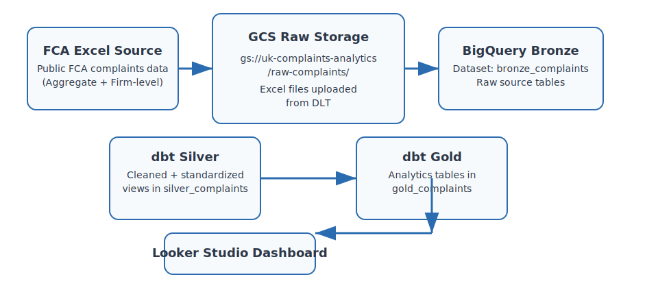

# UK Financial Complaints Analytics Platform

Capstone project for Data Engineering Zoomcamp 2026.

## Project Summary
This project mirrors the workflow of a Data Engineer in Financial Services working with regulated complaints and customer outcomes. It builds an end-to-end batch analytics pipeline that ingests public UK financial complaint data from FCA sources, transforms it into actionable insights, and powers a compliance dashboard for monitoring complaints trends, firm performance, and product issues.

## Problem Statement
UK financial services firms are required by the FCA to track, report, and act on customer complaints. However, many firms struggle to:
- Understand which products generate the most complaints
- Identify which firms are performing poorly compared to peers
- Detect emerging trends before they become regulatory issues
- Provide timely visibility to compliance teams

This platform addresses those problems by creating a structured, auditable analytics workflow from raw FCA complaint files to gold-level metrics.

## Project Scope
- Batch ingestion on a monthly schedule
- Public UK FCA complaint data as the source
- Raw Excel files stored in Google Cloud Storage
- Bronze, silver, and gold transformations in BigQuery using dbt
- Orchestration with Kestra
- Dashboard-ready analytics for compliance monitoring in Looker Studio

## Why This Project?
- Uses real UK financial services data aligned with regulatory compliance context
- Demonstrates end-to-end data engineering skills for regulated data
- Supports analytics for complaints, uphold rates, and firm performance
- Is suitable for orchestration, scheduling, and repeatable batch delivery

## Medallion Architecture
The pipeline follows the Medallion Architecture with the following layers:

| Layer | Description |
|---|---|
| Bronze | Raw Excel files ingested from source and loaded into BigQuery staging tables |
| Silver | Cleaned, standardized, and validated datasets in BigQuery |
| Gold | Aggregated analytics tables and dimensional models in BigQuery |
| Dashboard | Looker Studio dashboard consuming gold models for regulatory monitoring |

## Data Field Metadata
- `Firm name` – The financial institution
- `Product / service` – Banking, credit, insurance, investment, etc.
- `Complaints received` – Number of complaints
- `Upheld` – Number of complaints upheld in favour of the customer
- `Settled` – Number settled before a final decision
- `Closed without upheld` – Number closed without being upheld
- `Reporting period` – Month and year or semiannual period

The project currently ingests data for the 2025 H1 reporting period.

## Business Questions Answered
- Which firms receive the most complaints?
- Which products have the highest uphold rates?
- How are complaint trends changing over time?
- Which firms are improving month-over-month?

## Technology Stack
| Layer | Technology | Purpose |
|---|---|---|
| Cloud | Google Cloud Platform (GCP) | Infrastructure and analytics storage |
| IaC | Terraform | Provision GCP resources |
| Orchestration | Kestra | Schedule and run pipeline tasks |
| Data Lake | Google Cloud Storage (GCS) | Store raw complaint files |
| Ingestion | dlt (Data Load Tool) | Load raw source files into BigQuery |
| Data Warehouse | BigQuery | Store and query structured data |
| Transformations | dbt | SQL models, tests, and documentation |
| Visualization | Looker Studio | Interactive compliance dashboard |
| CI/CD | GitHub Actions | Automate testing and deployment |

## Architecture Diagram


## Key Components
- `dlt/complaints_pipeline_complete.py` – ingests raw complaint Excel files, uploads them to GCS, and loads bronze BigQuery tables
- `dbt/` – defines bronze, silver, and gold models plus tests
- `kestra/flows/uk_complaints_pipeline.yml` – end-to-end orchestration flow
- `terraform/` – provisions the raw storage bucket and bronze/silver/gold BigQuery datasets
- `docs/metadata_dictionary.md` – field-level metadata and model mapping

## Prerequisites
- Google Cloud Platform account with BigQuery and Cloud Storage enabled
- Service account key with BigQuery Admin and Storage Admin permissions
- Python 3.9+
- Terraform 1.0+
- dbt BigQuery adapter

## Setup
### 1. Clone the repository
```bash
git clone <repository-url>
cd uk-financial-complaints-pipeline
```

### 2. Configure GCP credentials
1. Create a Google Cloud service account with:
   - BigQuery Admin
   - Storage Admin
2. Download the JSON key file.
3. Set `GOOGLE_APPLICATION_CREDENTIALS` to the key file path.
4. Optionally, copy `.env.example` to `.env` and update project values.

### 3. Provision infrastructure
```bash
cd terraform
terraform init
terraform plan -var="project_id=uk-complaints-analytics"
terraform apply -var="project_id=uk-complaints-analytics"
```

This creates:
- `gs://uk-complaints-analytics-raw-complaints`
- BigQuery datasets: `bronze_complaints`, `silver_complaints`, `gold_complaints`

### 4. Install DLT dependencies
```bash
cd ..
python -m venv .venv
source .venv/bin/activate
pip install -r dlt/requirements.txt
```

### 5. Install dbt dependencies
```bash
pip install -r dbt/requirements.txt
```

## Run the pipeline
### Ingest raw data and load bronze tables
```bash
python dlt/complaints_pipeline_complete.py
```

### Run dbt transformations
```bash
cd dbt
dbt deps
dbt run
dbt test
```

### Run the complete Kestra flow
Execute `kestra/flows/uk_complaints_pipeline.yml` in Kestra to run ingestion and dbt transformation tasks sequentially.

## Data Layers and Models
### Raw layer
- Raw Excel files are stored under `gs://uk-complaints-analytics-raw-complaints/raw/complaints/`
- Files are downloaded from public UK complaint sources

### Bronze layer
- `bronze_complaints.complaints_aggregate`
- `bronze_complaints.complaints_firm_specific`

### Silver layer
- `silver_complaints.int_complaints_aggregate_cleaned` — separates complaint metrics from raw redress and provision values so `complaint_count` only reflects complaint totals
- `silver_complaints.int_complaints_firm_cleaned`

### Gold layer
- `gold_complaints.dim_product`
- `gold_complaints.dim_firm`
- `gold_complaints.fct_complaints_monthly` — now includes complaint totals plus aggregated redress and provision amounts for dashboard metrics; schema tests verify redress and provision fields are populated for the correct metric types
- `gold_complaints.fct_complaints_semiannual` — now surfaces raw metric values alongside complaint totals, redress, and provision data

### Dashboard query example
```sql
SELECT
  complaint_period,
  product_group,
  metric_type,
  total_complaints,
  total_redress_paid,
  total_provision_amount,
  total_metric_value
FROM `uk-complaints-analytics.gold_complaints.fct_complaints_monthly`
WHERE metric_type IN ('Complaints received', 'Redress paid', 'Provision')
ORDER BY complaint_period DESC, product_group, metric_type;
```
This query makes the redress and provision amounts explicit for dashboard widgets while keeping complaint totals separate.

## Metadata and Data Dictionary
Field-level metadata and model details are available in `docs/metadata_dictionary.md`.

## Notes
- The project uses `europe-west2` for all GCP resources.
- `GOOGLE_APPLICATION_CREDENTIALS` must point to your service account JSON key.
- `dlt/complaints_pipeline_complete.py` loads the current bronze dataset `bronze_complaints` in project `uk-complaints-analytics`.
- `bronze_complaints.complaints_aggregate` preserves raw source volumes in `metric_value`; `silver_complaints.int_complaints_aggregate_cleaned` derives `complaint_count` only for complaint metrics and excludes redress/provision amounts from complaint totals.
- Firm-level staging may require schema alignment before full firm-specific analytics are available.

## CI/CD
GitHub Actions are used to validate the UK complaints pipeline.
The CI workflow installs DLT and dbt dependencies, validates Python scripts, and fetches dbt packages before pull requests and pushes.

Workflow file:
- `.github/workflows/uk_complaints_pipeline_ci.yml`

Optional dbt compilation can run if `GCP_SERVICE_ACCOUNT_KEY` is provided as a repository secret.

See `GITHUB_ACTIONS.md` in the repository root for workflow details and secret configuration.

## Project Structure
```
uk-financial-complaints-pipeline/
├── dlt/                    # Data ingestion scripts and raw file loader
├── dbt/                    # Transformation models and dbt project files
├── kestra/                 # Workflow orchestration definitions
├── terraform/              # GCP infrastructure provisioning
├── docs/                   # Pipeline documentation and metadata
├── data/                   # Local working data files
├── logs/                   # Execution logs
└── README.md              # Project documentation
```

## Project Screenshots

## Kestra Orchestration:


## Big Query (GCP)


## Dashboard (Looker Studio)
## url: https://datastudio.google.com/reporting/d27aae31-ed68-4c4a-a576-e73a0ea7b02c


## Resources
- FCA Complaint Data (UK public CKAN): https://www.gov.uk/government/statistical-data-sets/financial-conduct-authority-complaints-data
- FOS Complaint Data: https://www.financial-ombudsman.org.uk/data-insight/data/complaints-data
- dlt Documentation: https://dlthub.com/docs
- dbt Documentation: https://docs.getdbt.com
- Kestra Documentation: https://kestra.io/docs
- Terraform GCP Provider: https://registry.terraform.io/providers/hashicorp/google/latest/docs

## Contributing
1. Fork the repository
2. Create a feature branch
3. Update code and documentation
4. Submit a pull request

## License
MIT License
